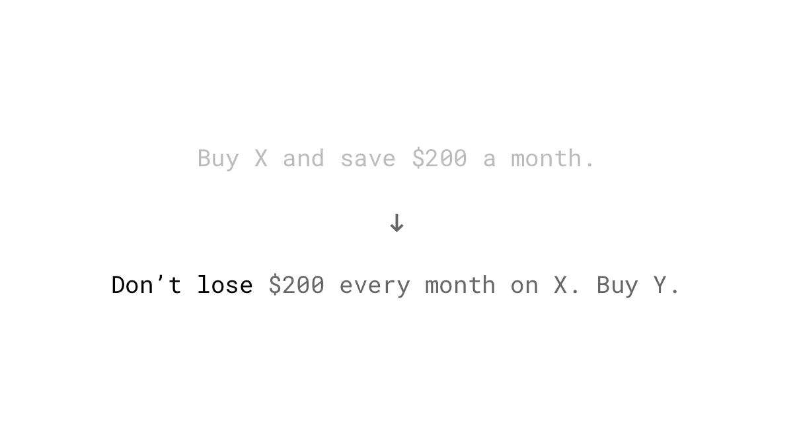
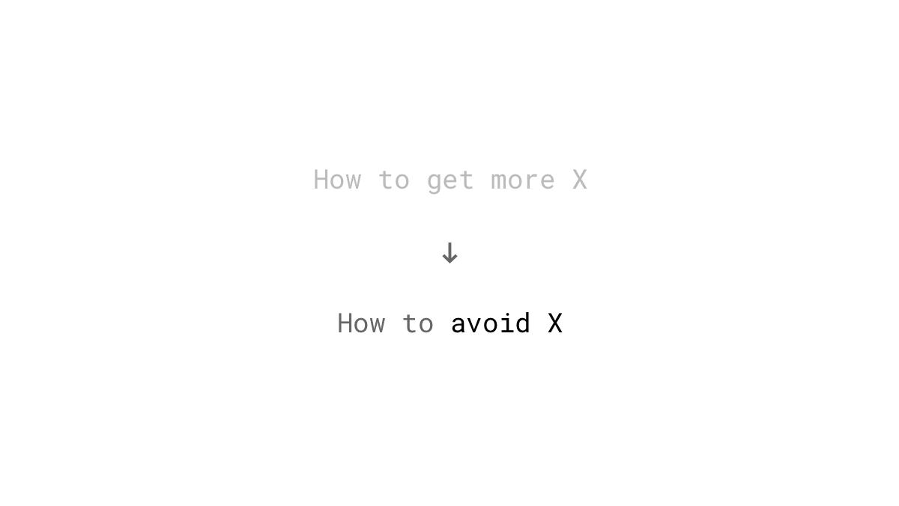
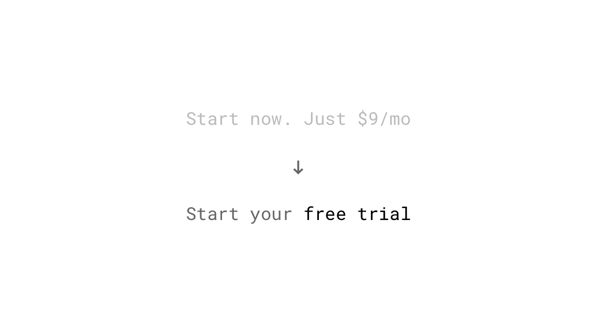
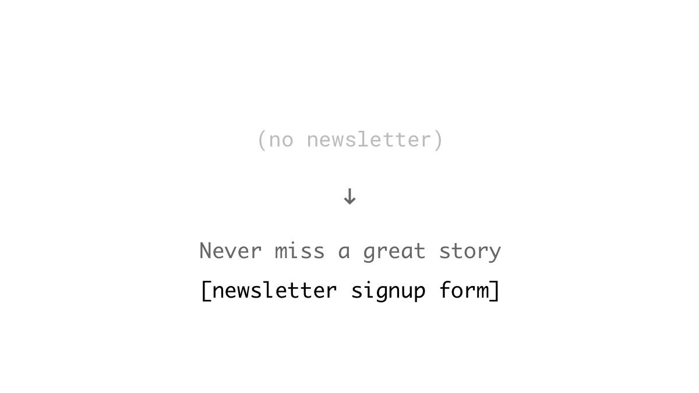
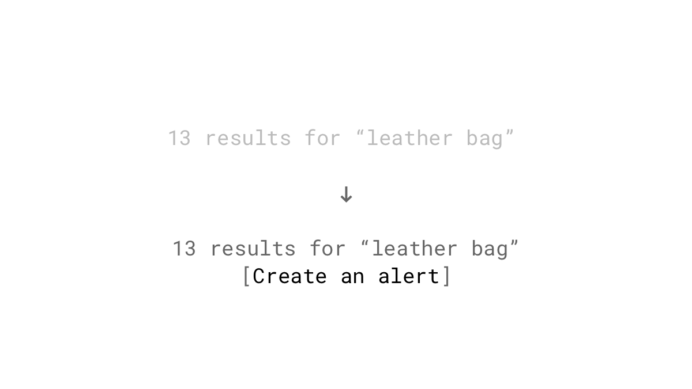
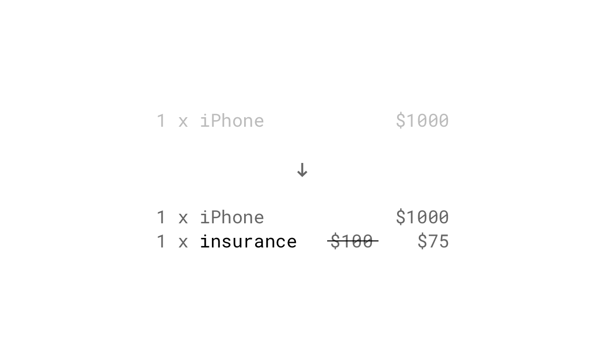

People feel losses more deeply than gains of the same value. In other words, it's more painful to lose something than the positive feelings from the getting the same thing.

Imagine you overhear your boss talking to the HR manager about giving you a raise of $200 per month. How would you feel about this surprising boost in pay? How would you feel if you hear your boss saying he wants to cut your salary by the same amount?

## Studies

We tend to give losses twice as much more psychological weight as gains. ([Tversky & Kahneman, 1992](http://cemi.ehess.fr/docannexe/file/2780/tversjy_kahneman_advances.pdf))

Losses have not as much as an impact as they are predicted. We tend to overestimate to dwell on negative experiences. Therefore is loss aversion more a property of forecasts than a characteristic of an actual experience. ([Kermer, Driver-Linn, Wilson & Gilbert, 2006](http://journals.sagepub.com/doi/abs/10.1111/j.1467-9280.2006.01760.x))

Investors tend to be more prone to "Myopic Loss Aversion" (MLA), a concept of a combination of high sensitivity to losses and a tendency to check their wealth too frequently. This bias leads to a short-term view that causes irrational decisions. ([Haigh & List, 2005](http://onlinelibrary.wiley.com/doi/10.1111/j.1540-6261.2005.00737.x/full))

## Examples

### Focusing on the loss in offers

Talk of what your potential customer will lose if they don’t purchase rather than what they would gain by buying.

### Focusing on the loss in headlines

The same principle can also be applied to headlines of landing pages or blog posts.

### Free trials

Loss aversion is one of the reasons why free trials work so well for SaaS businesses. When for example the 30 days of the trial period end, giving up premium features or the complete service feels like losing.

### Lazy registration

Let your customers enter data into your service before even signing up. So, they get to play with the app and invest time. To be able to save their work they have to register an account. This step is then smaller than losing what they have already built.

### Newsletters

You don't want to miss out on a great deal, right? What about posts from your favorite blogger? Provide exceptional value to your audience, and they will fear they will miss out something.

### Providing a subscription feature

Do you manage a SaaS business, an online marketplace or a community platform? Let your users subscribe to get notified when a long-running task finished, a price dropped, or someone posted something new. Find out which information your users could miss out and add an ability to create an [external trigger](/trigger/) for it.

### Pre-filling the shopping cart

Preload the shopping cart with discounted upsells. Users will hesitate to remove them from the cart as they have already "got" them. If they don't buy the upsells now, at the discounted price, they feel they're likely to miss out on saving some money. This tactic may be considered as a dark pattern. Users can overlook the additional items and buy them without knowing it.

### Scarcity

As things become less available, they become more desirable. The fear of losing out on something can be a huge motivator. Sometimes, the buzz created by the scarcity is sufficient to create a rush of panic buying. Because it's such a powerful tool, I've dedicated a whole post to the [principle of scarcity](/scarcity/).

