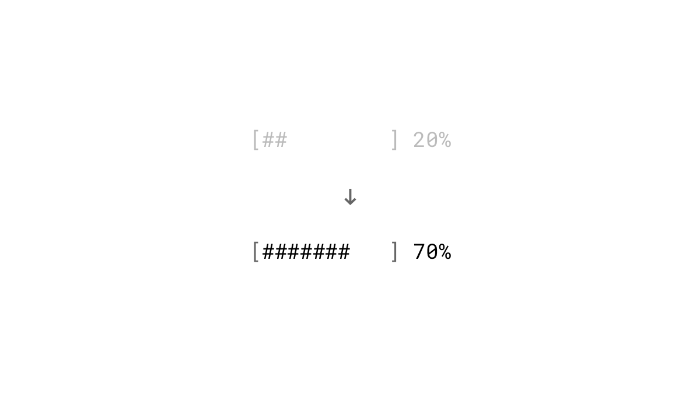

We as humans don't like to leave things incomplete. We are motivated to finish a set of tasks even with no further reward other than the satisfaction of completion.

### Studies

During the Christmas season in 2016, Harvard researchers conducted a study with the Canadian Red Cross. Potential donors were directed to one of three landing pages. The first group received a request for cash donations. The second group was asked to select gifts from a selection of six items like blankets, baby diapers or hot meals among others. A location marker on a globe indicated where the selected items would be donated. The third landing page offered the same gifts but in a pseudo-set called "Global Survival Kit". Each time an item was selected, instead of location markers, a line grew further around the globe. A closed circle meant that all six items were funded, but potential donors could choose as many gifts as they wanted. 21% of the people in the third group decided to donate all six gifts, compared with only 5% on the second page and 3% in the cash condition. ([Barasz, John, Keenan & Norton, 2017](http://www.hbs.edu/faculty/Pages/item.aspx?num=52665))

### Examples

### Starting with a high percentage
Make your progress indicator prominent and show already after the first completed task a relative high completion rate. We are more motivated to reach a goal the closer we get to it ([Kivetz, Urminsky & Zheng, 2006](http://www.quilageo.com/wp-content/uploads/2013/07/Goal-Gradient_Illusionary_Goal_Progress.pdf)).

