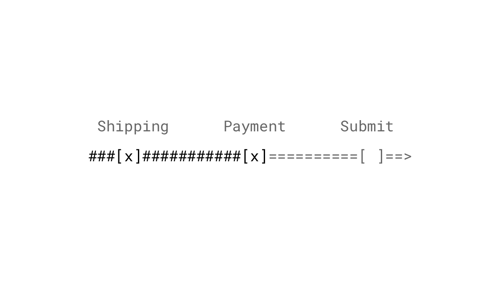

We as humans don't like to leave things incomplete. We are motivated to finish a set of tasks even with no further reward other than the satisfaction of completion.

## Studies

During the Christmas season in 2016, Harvard researchers conducted a study with the Canadian Red Cross. Potential donors were directed to one of three landing pages. The first group received a request for cash donations. The second group was asked to select gifts from a selection of six items like blankets, baby diapers or hot meals among others. A location marker on a globe indicated where the selected items would be donated. The third landing page offered the same gifts but in a pseudo-set called "Global Survival Kit". Each time an item was selected, instead of location markers, a line grew further around the globe. A closed circle meant that all six items were funded, but potential donors could choose as many gifts as they wanted. 21% of the people in the third group decided to donate all six gifts, compared with only 5% on the second page and 3% in the cash condition. ([Barasz, John, Keenan & Norton, 2017](http://www.hbs.edu/faculty/Pages/item.aspx?num=52665))

## Examples

### Wizards
No, I don't mean those bearded guys with hats. We're talking here about the step-by-step process that takes the user through a sequence of forms. It's a popular design pattern to split up complex forms into smaller more digestible tasks. Display either a progress bar or the number of steps that are left to indicate users how long the whole process will take. An indicator will also act as a reminder of how much time they've already invested – time that [would be lost](/loss-aversion/) should they not complete the process.

### Progress bars
People [want](http://dl.acm.org/citation.cfm?id=317459) progress indicators. They give feedback about the current status but also stimulate the desire to continue a process. Each time the progress bar moves through our actions, we feel the positive effects of dopamine which motivates us to repeat the previous task. This phenomenon is also referred as *self-directed learning* which is likely evolutionary developed to maximize learning opportunities and is therefore crucial for reproducing human intelligence ([Herd, Mingus & O'Reilly, 2010](https://grey.colorado.edu/mediawiki/sites/mingus/images/c/c0/HerdMingusOReilly10.pdf)).

### Starting with a high percentage
Make your progress indicator prominent and show already after the first completed task a relative high completion rate. We are more motivated to reach a goal the closer we get to it ([Kivetz, Urminsky & Zheng, 2006](http://www.quilageo.com/wp-content/uploads/2013/07/Goal-Gradient_Illusionary_Goal_Progress.pdf)).

### Counters and notifications
You might have heard about the [Inbox Zero](https://www.youtube.com/watch?v=z9UjeTMb3Yk) approach: a technique developed by Merlin Mann to keep your email inbox almost all the time empty. For many people triggers a counter, that indicates incomplete tasks, discomfort which we try to avoid. According to a study from 2002, reacted employees to 70% of their unread emails [within 6 seconds](https://dspace.lboro.ac.uk/dspace-jspui/bitstream/2134/489/3/Ease%2525202002%252520Jackson.pdf). These interruptions can be instant gratifications. They give us little dopamine rushes every time we complete something, which in turn reinforces us to lurk for more distractions.

### Todo lists

### Profile completeness

### Upload progress