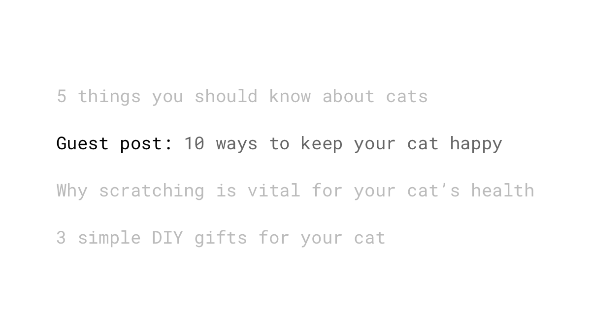
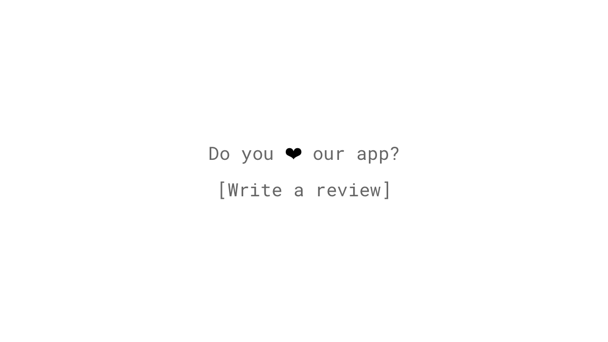
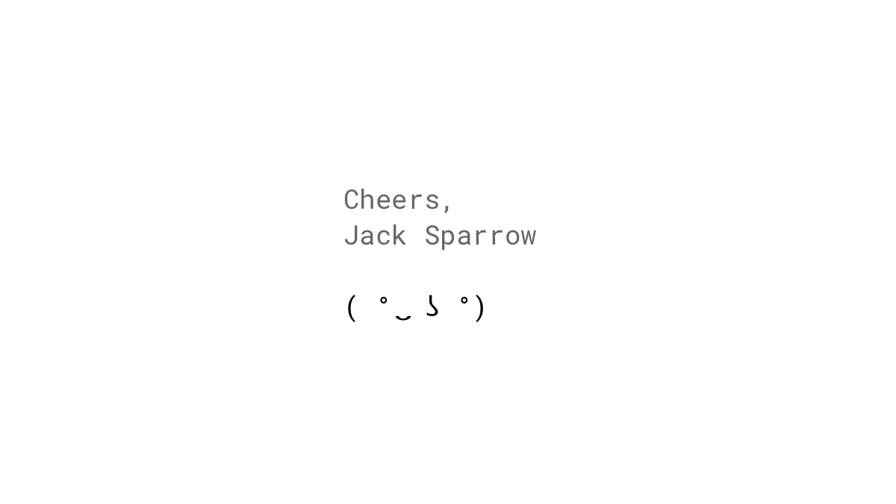
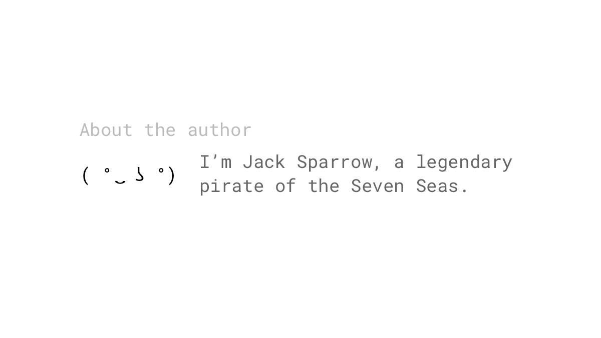
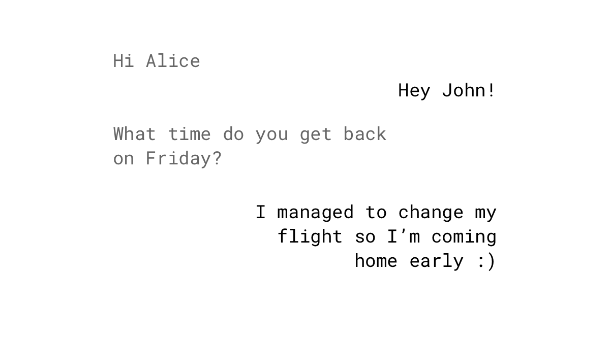

*“You will get all you want in life if you help enough other people get what they want.”* Zig Ziglar

We feel a sense of obligation to return favors to people who have done something for us. This rule works not only with people you know but also with strangers. It's a human characteristic that allows us to live as a society ([Gouldner, 1960](https://www.jstor.org/stable/2092623?seq=1#page_scan_tab_contents)).

## Studies

In an experiment by [Regan (1971)](http://www.communicationcache.com/uploads/1/0/8/8/10887248/effects_of_a_favor_and_liking_on_compliance.pdf), a subject thought that they were evaluating art. Also in the room was a fellow participant, who was, in reality, a research assistant. In one condition, the assistant would leave the room and bring back two cans of Coke – for him and the subject. In another condition, he would return empty-handed. At the end of the experiment, the assistant asked the participants if they would buy a raffle ticket from him. As expected, the subjects who had received the gift were twice as likely to purchase tickets, even though the tickets were far more expensive than the can of soda had been.

Reciprocity outperforms reward as a principle of persuasion when it comes to collecting correct contact information from a user. According to [Gamberini, Petrucci, Spoto and Spagnolli (2007](https://link.springer.com/chapter/10.1007%2F978-3-540-77006-0_24)), asking for contact details, which would unlock a link to a whitepaper (reward) generated slightly more entries, but most of them were invalid; whereas providing the whitepaper for free and then asking for contact information for further news (reciprocity) led to less entries, but more valid ones overall.

Even very inexpensive meals (< $20) sponsored by pharmaceutical firms led to an increase in physician prescriptions of the promoted brand-name medication, even when a generic equivalent was available ([DeJong et al., 2016](http://jamanetwork.com/journals/jamainternalmedicine/article-abstract/2528290)).

## Examples

### Guest blogging
Write unique and high-quality posts for other blogs, of which they can be proud. To give back, they will be more likely to promote the content more vigorously, or offer to write something on your blog in return. It's not unusual for an outstanding guest post to result in a long-standing partnership.

### Gifts in social games
All gifting mechanisms in social games like FarmVille or Mafia Wars where a user can send in-game items to a friend, rely on the principle of reciprocity. If I send you something, wouldn't you send me something back?

### Asking for app ratings
First and foremost: build a great app. Once that requirement is met, make sure that a positive experience exists before asking a user to rate your app, e.g. after a booking, purchase, or being a loyal user for several days.

### 10x content marketing
Give away value in the form of free, kick-ass blog posts, webinars, ebooks, whitepapers, videos, mini-applications, and so on. People got used to receiving mediocre freebies, and you're expected to give everything away nowadays. It's rarely perceived as a favor. Create something that is ten times better than the best result you can find on your topic. When your content enables someone to yield results, they are more likely to give back by sharing it, or even becoming a paying customer. What about asking for an email address before giving access to the content? No, that's not a reciprocity-invoking tactic.

### Showing your face in cold emails
In a study, subjects were requested to fill out a survey, which they received by email. Attaching a sender's photograph at the end of the email increased the compliance rate ([Guéguen & Jacob, 2004](http://online.liebertpub.com/doi/abs/10.1089/109493102753770525)). That's exactly what Stephen Twomey did in [an experiment](https://justreachout.io/blog/howto-increase-response-rate-email-pitch/) where he pitched his guest posts. He increased the response rate with this technique by 333.33%.

### Building trust by breaking anonymity
Use the same principle in other areas to increase the likelihood of reciprocity: add an author box to each blog post, show the faces behind your brand on your social media accounts, or create an "About Us" page for your product. Trust and reciprocity often go hand-in-hand ([Berg, Dickhaut & McCabe, 1995](http://www.sciencedirect.com/science/article/pii/S0899825685710275)).

### Free coaching sessions
This act works like the previously-mentioned content marketing freebies, but instead of being anonymous, the attendee has to put away his anonymity. A study shows that people who received a favor and were required to put their contact information on a pledge card were more likely to comply with the donation request ([Whatley, Webster, Smith & Rhodes, 1999](https://www.researchgate.net/publication/247808309_The_Effect_of_a_Favor_on_Public_and_Private_Compliance_How_Internalized_is_the_Norm_of_Reciprocity)).

### Messaging
Following the reciprocity rule, when a user gets a message within Whatsapp, Facebook, Snapchat, or elsewhere, the recipient is somewhat obligated to send something back. In Snapchat, this effect is increased even more because "Snaps" disappear in seconds. You need to reply promptly before you forget what you got.

