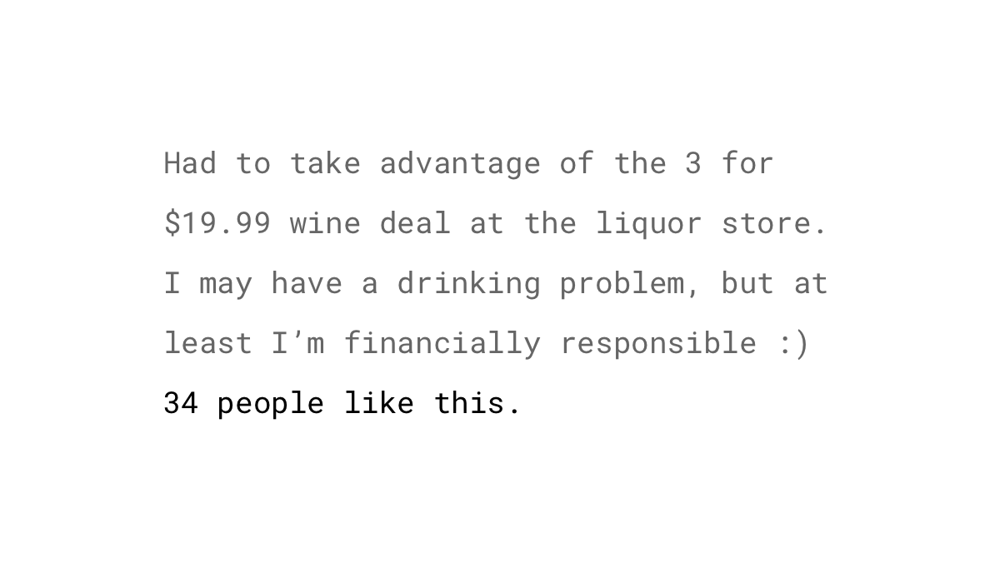
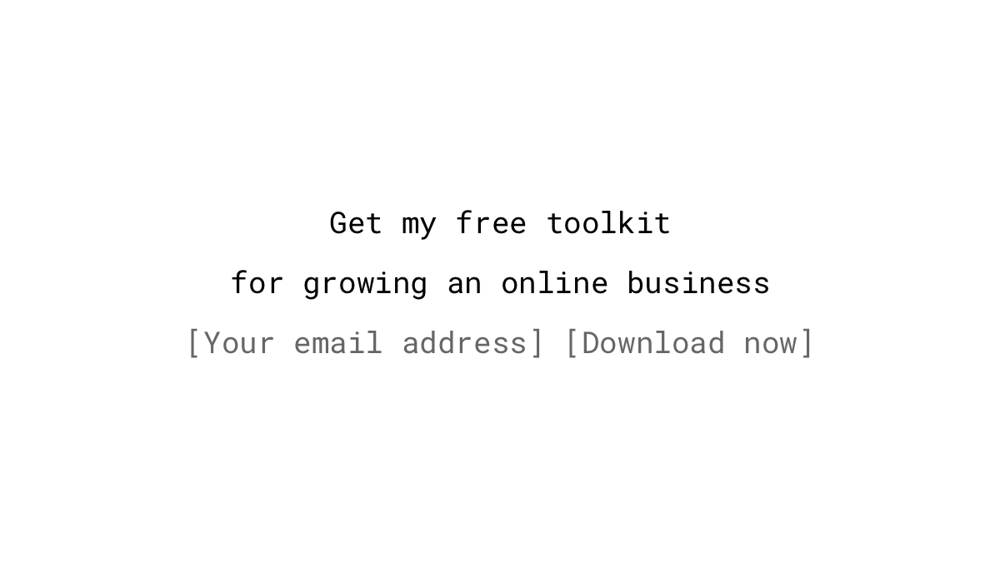
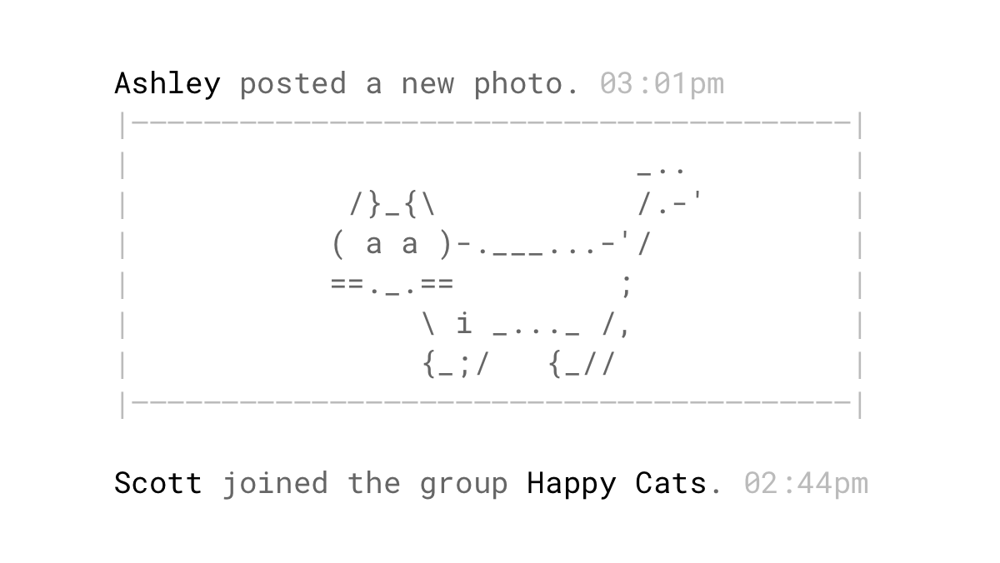
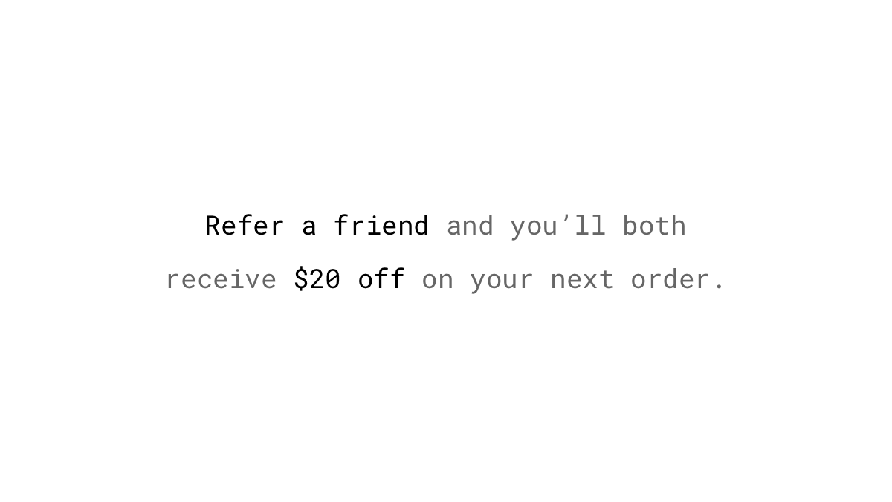
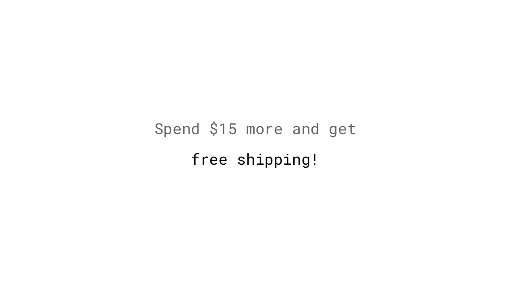
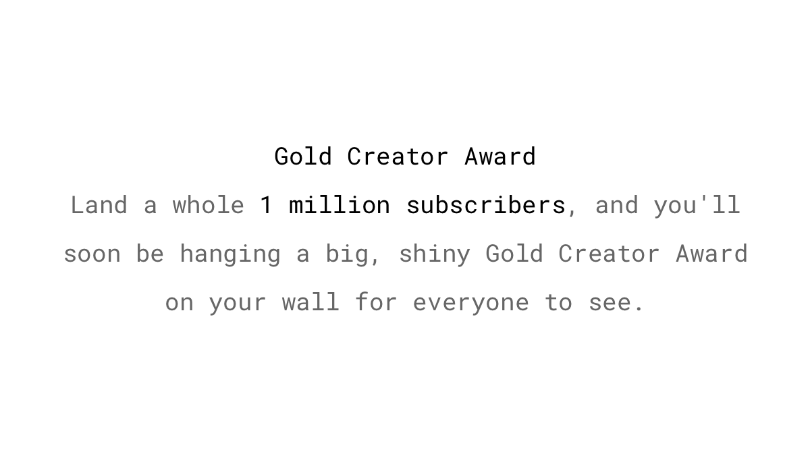

Everybody likes rewards and appreciation. A shot of dopamine gets released and mediates pleasure in the brain. The increase in the dopamine level also encourages our brain to remember the prior action so that we can repeat it to get the reward again. In other words: rewards make us come back for more.

We distinguish between fixed and variable rewards. The first type is straightforward: we know exactly what to do to get rewarded. Every time the goal is reached we earn something. On the other hand, variable rewards are unpredictable and foster curiosity.

## Studies

If we're unsure when we will get a "treat," we continue to act – just in case. This phenomenon is known as the *partial reinforcement effect*. Even if the reward disappears entirely, this behavioral pattern will continue for a while because we don't know if it's just a longer pause than usual before the next reward. Intermittently reinforced behavior is more persistent than behavior that is acknowledged each time it occurs ([Nevin, 1988](https://www.researchgate.net/publication/247408514_Behavioral_Momentum_and_the_Partial_Reinforcement_Effect)). So if you want consistent behavior, don’t reward people every time they do something.

The continuation of the response during the condition where no reinforcers are given is called *resistance to extinction*. [Horsley, Osborne, Norman and Wells (2012)](https://www.researchgate.net/publication/221774874_High-frequency_gamblers_show_increased_resistance_to_extinction_following_partial_reinforcement) have found that high-frequency gamblers show an increased resistance. It's open to debate whether it's a cause or an effect of constant gambling.

The researchers [Skinner and Ferster (1957)](https://books.google.ch/books?id=xctyCQAAQBAJ) observed that rats respond more often with the desired behavior to press a lever when the rewards were random. Some lever presses succeeded in getting a food pellet, but most went unreinforced.

## Examples

### Points
Points are a form of positive reinforcement in gamified environments. They give feedback to people on how they are progressing. To spur the desired behaviors even more, they can be weighted. If your goal is to drive more user-generated content, give more points to those who create posts than to those who are just liking existing ones. While this game mechanic is interesting, users are not in the system for the points. Reaching a specific amount should yield to additional rewards, like the next level, badges, or more tangible benefits like discounts, freebies and so on. Or even better: Promote intrinsic values. Sites like StackOverflow, a question-and-answer site for programmers, use points to indicate the reputation of their users. Helpful advice gets upvoted by others and, therefore, the more points someone has, the more he is perceived as knowledgeable.

### Badges, trophies, ribbons, and levels
A badge, or a similar concept, is a visible acknowledgment received for a particular action, a period of activity, or as a result of another reward. These days, badges do not have the best reputation in the gamification community because they’re overused, especially in combination with points and leaderboards (PBL). But, they can be effective when they represent something meaningful. Organizations like the military use a similar mechanism to get people to take incredible action. Used wisely, badges can provide trust and reputation in community or marketplace platforms. Try to avoid awarding quantity over quality. Consider raising the bar or limiting the availability of some badges to play up the [scarcity](/scarcity/) game.

### Unlocked features
Another way to reward users virtually is to grant them more privileges when they have performed certain actions or reached a specific amount of points. These unlockable features can be anything from increased voting rights to moderation power.

### Early access
Reward early adopters and loyal customers with no extra content – you just take the great stuff you’re already creating and allow some people to see it before the crowd. Notify an exclusive group earlier about discounts, trying beta versions of your new applications, or e-books before they are public to everyone. This tactic also gives you the opportunity to add [social proof](/social-proof/) in advance of a launch by getting user reviews.

### Likes, views, and followers
It is clear that positive reinforcement is a big, motivating factor. And what can be more pleasant online than getting views, retweets, and likes for things that we post? It seems that we’re constantly chasing other people’s approval and wonder how much social validation our creations will receive. Its unpredictability makes it more intriguing. We don’t know whether a post will be rewarded with more attention than the previous one, which encourages us to come back over and over again (variable reward).

### Comments
Wall posts, direct messages, and comments are more satisfying than “one-click communication,” such as likes and pokes. When people receive messages from close friends on social media sites, they feel less lonely, and are happier and healthier ([Burke, 2011](http://repository.cmu.edu/cgi/viewcontent.cgi?article=1187&context=dissertations)). Takeaway: Reply to the comments of your fans, even the negative ones – your response could turn a bad situation into a very positive customer service experience. Or, go further and make commenting a part of your digital product.

### Intrinsic rewards from self-disclosure
A Harvard study showed that sharing information about ourselves stimulates the same parts of the brain that are activated by pleasurable activities, such as eating or having sex. They also found that sharing our thoughts and opinions with other people yields even more activity in the reward region than if we keep them private ([Tamir & Mitchell, 2012](https://www.ncbi.nlm.nih.gov/pmc/articles/PMC3361411/)). That may be one reason why even crimes are posted or [broadcasted live](https://www.theguardian.com/technology/2017/jan/27/rising-numbers-of-criminals-are-using-facebook-to-document-their-crimes) on social media sites. The combination of self-disclosure and the desire for more likes makes this cocktail so addictive to people.

### Incentives for signing up for the newsletter
Get people to give you their email address by providing high-quality, free stuff, like e-books, checklists, online courses or discounts, as an incentive they can’t resist. It’s especially important that you see these things from your visitor’s perspective and offer something that’s directly beneficial to their life. Test different titles, images, and colors to increase the conversion rate of your newsletter signup form. That’s exactly what John Corcoran did, which led to an [increase in sign ups by over 3000%](https://fizzle.co/sparkline/how-i-increased-my-conversion-rate).

### Variable rewards in the news feed
For many smartphone users, checking social media apps or news sites is the first thing they do in the morning – often, before even getting out of bed. The simplest actions, like scrolling through your Facebook, Twitter, or news site feed, are tied to immediate variable rewards. We don’t know if the next scroll will reveal some interesting photos, funny videos, or valuable information, so we keep scrolling and get sucked in. Researchers observed reactions in subjects, like pupil dilation, while browsing Facebook, which indicates being in the flow, a state of complete immersion in an activity with a feeling of enjoyment and energized focus ([Mauri, Cipresso, Balgera, Villamira & Riva, 2011](http://online.liebertpub.com/doi/abs/10.1089/cyber.2010.0377)).

### Handwritten acknowledgments
[An experiment](http://www.huffingtonpost.com/dave-kerpen/the-roi-of-gratefulness_b_2022845.html) conducted by Donors Choose found that contributors thanked with a handwritten letter were 38% more likely to donate again. Because handwritten notes are so rare nowadays, they are perceived as more valuable.

### Discount for referring a friend
Offer a fixed (e.g., $25 off) or percentage discount (e.g., 10% off) to someone who is recommending your product or service. However, according to tests conducted by Annex Cloud, [fixed dollar amounts are more compelling](http://www.annexcloud.com/blog/2016/05/26/get-people-participate-refer-a-friend-programs/) than a percentage off the purchase. The timing for asking for referrals is also crucial: Don’t expect someone to provide a recommendation if he’s not completely satisfied. Ask them when they’re already on a dopamine high; right after a successful purchase, or after completing an important or lengthy task in your application.

### Free shipping after a certain dollar amount
Nowadays, customers expect fast and free shipping, but it can be costly for the stores to live up to these expectations. Offering free shipping for purchases after a certain amount is a compromise that can even boost your average order value. A [case study](https://www.reddoor.biz/blog/case-study-rdi-a-b-testing-finds-that-adding-free/) showed how NuFace, a store for skin care products, increased their orders by 90% when adding a free shipping threshold as an incentive.

### Physical prizes
Be different in today’s digital age by giving away real, physical awards to your users when they achieve special milestones. That’s exactly what YouTube does to honor popular channels. If someone reaches a specific number of subscribers (100k, 1M, 10M), they get a plaque with a *Play Button* on it, so it can be hung for all to see. Achieving the milestones requires a lot of effort and hard work. So, getting such an award also means attaining more intrinsic rewards, like increased pride and prestige.

