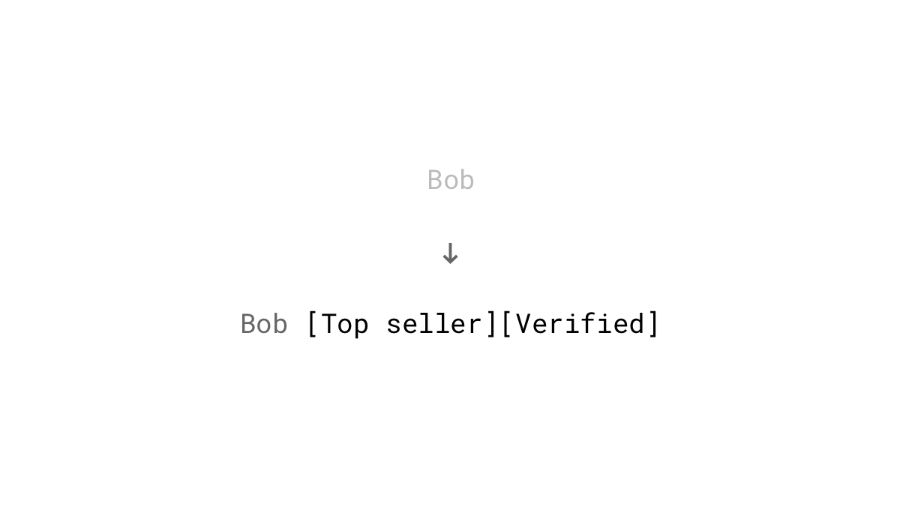
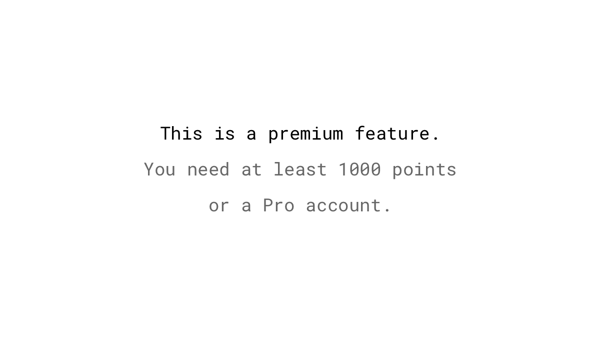
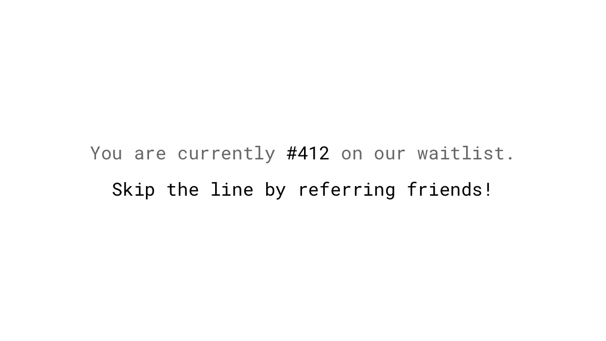

Everybody likes rewards and appreciation. A shot of dopamine gets released and mediates pleasure in the brain. The increase in dopamine level also encourages our brain to remember the prior action so that we can repeat it to get the reward again. In other words: rewards make us come back for more.

We distinguish between fixed and variable rewards. The first type is straight forward: we know excatly what to do to get rewarded. Every time the goal is reached we earn something. On the other hand, variable rewards are unpredictable and foster curiosity.

Related: [Classical conditioning](https://en.wikipedia.org/wiki/Classical_conditioning), [Positive reinforcement](https://en.wikipedia.org/wiki/Reinforcement#Positive_reinforcement)

## Studies

If we're unsure when we get a "treat," we continue to act – just in case. This phenomenon is known as the *partial reinforcement effect*. Even if the reward entirely disappears, this behavioral pattern will continue for a while because we don't know if it's just a longer pause than usual before the next reward. Intermittently reinforced behavior is more persistent than behavior that is acknowledged each time it occurs. So if you want consistent behavior don’t reward people every time they do something. ([Nevin, 1988](https://www.researchgate.net/publication/247408514_Behavioral_Momentum_and_the_Partial_Reinforcement_Effect))

The continuation of the response during the condition where no reinforcers are given is called *resistance to extinction*. Researchers have found out that high-frequency gamblers show an increased resistance. It's open whether it's a cause or an effect of constant gambling. ([Horsley, Osborne, Norman & Wells, 2012](https://www.researchgate.net/publication/221774874_High-frequency_gamblers_show_increased_resistance_to_extinction_following_partial_reinforcement))

Researchers observed that rats respond more often with the desired behavior to press a lever when the rewards were random. Some lever presses succeeded in getting a food pellet, but most went unreinforced. ([Skinner & Ferster, 1957](https://books.google.ch/books?id=xctyCQAAQBAJ))

## Examples

### Point systems
Points are a form of positive reinforcement in gamified environments. They give feedback to people on how they are progressing. To spur even more the desired behaviors, they can be weighted. If your goal is to drive more user-generated content, give more points to those who create posts than to those who are just liking existing ones. While this game mechanic is interesting, users are not in the system for the points. Reaching a specific amount should yield to additional rewards like the next level, badges or more tangible benefits like discounts, freebies and so on. Or even better: Promote intrinsic values. Sites like StackOverflow, a question-and-answer site for programmers, use points to indicate the reputation their users. Helpful advice gets upvoted by others and therefore the more points someone has, the more is he perceived as knowledgeable.

### Badges, trophies, ribbons and levels
A badge, or a similar concept, is a visible acknowledgment received for a particular action, a period of activity or as a result of another reward. These days badges have not the best reputation in the gamification community because they're overused, especially in combination with points and leaderboards (PBL). But they can be effective when they represent something meaningful. Organizations like the military use a similar mechanic to get people to take incredible action. Used wisely, badges can provide trust and reputation in community or marketplace platforms. Try to avoid to award quantity over quality. Consider raising the bar or limiting the availability of some badges to play up the [scarcity](/scarcity/) game.

### Unlocking features
Another way to reward users virtually is to grant them more privileges when they have performed certain actions or reached a specific amount of points. This unlockable features can be things from increased voting rights up to moderation power.

### Early access
Reward your early adopters and loyal customers with no extra content – you just take the great stuff you're already creating and allow some people to see it before the crowd. Let an exclusive group get notified earlier about discounts, try beta versions of your new applications or download e-books before it's public to everyone. This tactic also gives you the opportunity to add [social proof](/social-proof/) in advance of a launch by getting user reviews.

### Self-disclosure
A Harvard study shows that sharing information about ourselves stimulates the same parts of the brain which are also activated by pleasurable activities as we get from eating or having sex. They also found that sharing our thoughts and opinions to other persons yields to even more activity in the reward region of the brain than if we keep it private ([Tamir & Mitchell, 2012](https://www.ncbi.nlm.nih.gov/pmc/articles/PMC3361411/)). That's for sure one reason why social media sites are so addictive to many people and why even crimes are posted or [broadcasted live](https://www.theguardian.com/technology/2017/jan/27/rising-numbers-of-criminals-are-using-facebook-to-document-their-crimes) on Facebook.

### Likes, views, retweets, and followers
It is clear that positive reinforcement is a big motivating factor. And what can be online more pleasant than getting views, retweets or likes for things that we post? It seems that we're constantly chasing other people's approval. But what we don't know is, if a post will be rewarded with more attention than the previous one, which encourages us to come back over and over again (variable reward).

### Feed

### Rank

### affiliate

### Highscore

### Leaderboard

### Physical items
- Youtube play button

### Loyalty programs
- "It is now well recognized that an old customer retained is worth more than a new customer won"
- https://hbr.org/2006/04/your-loyalty-program-is-betraying-you
- http://prloyaltymarketing.com/review-of-article-by-nunes-and-dreze-2006/

### Weekly upload quota
- Vimeo

### Freebie for signing up for the newsletter
Get people to give you their email address by providing high-quality free stuff like e-books or online courses as an incentive they can't resist. It's especially important that you see the things from your visitor's perspective and offer something that's directly beneficial to their life. Test different titles, images, and colors to increase the conversion rate of your newsletter signup form. That's exactly what John Corcoran did which led to an [increase in sign ups by over 3000%](https://fizzle.co/sparkline/how-i-increased-my-conversion-rate).

### Discount for referring a friend
Offer a fixed (e.g., $25 off) or a percentage discount (e.g., 10% off) to someone who is recommending your product or service. However, according to tests conducted by Annex Cloud, [are fixed dollar amounts more compelling](http://www.annexcloud.com/blog/2016/05/26/get-people-participate-refer-a-friend-programs/) than a percentage off the purchase. The timing for asking for referrals is also crucial: Don't expect someone to provide a recommendation if he's not completely satisfied. Ask them when they're already on a dopamine high: right after a successful purchase or after completing an important or lengthy task in your application.

### Monetary rewards
other monetary rewards:
- free shipping
- redemptions