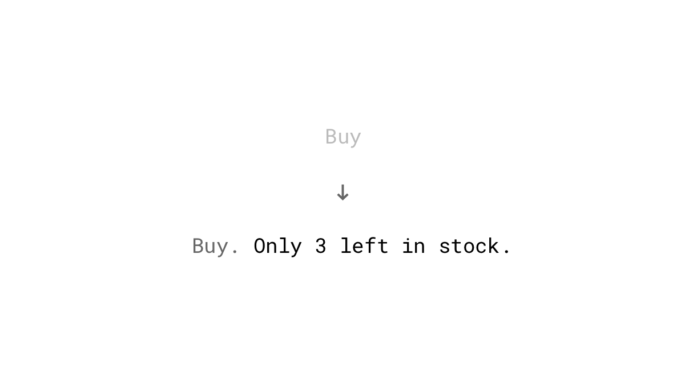
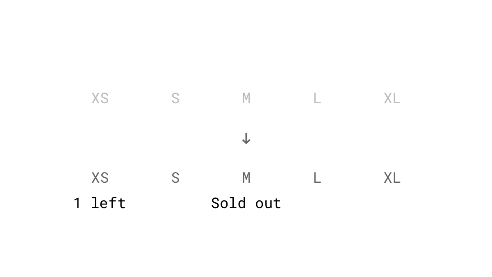
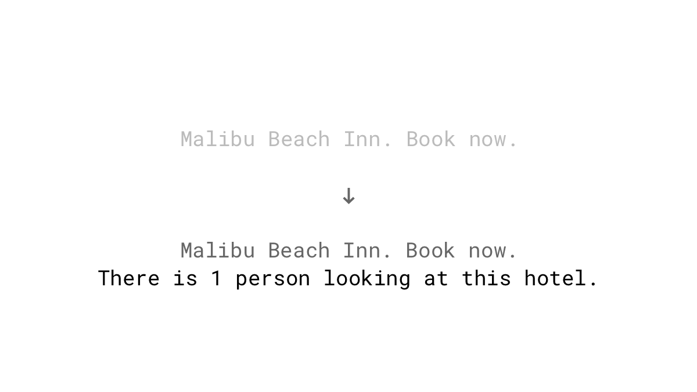
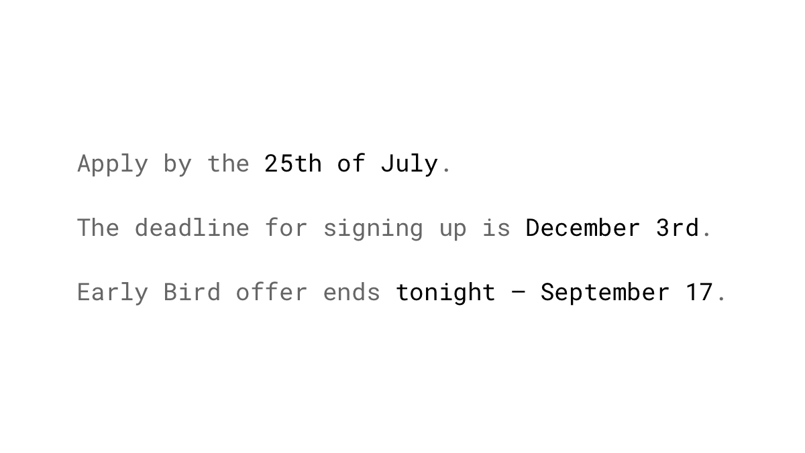
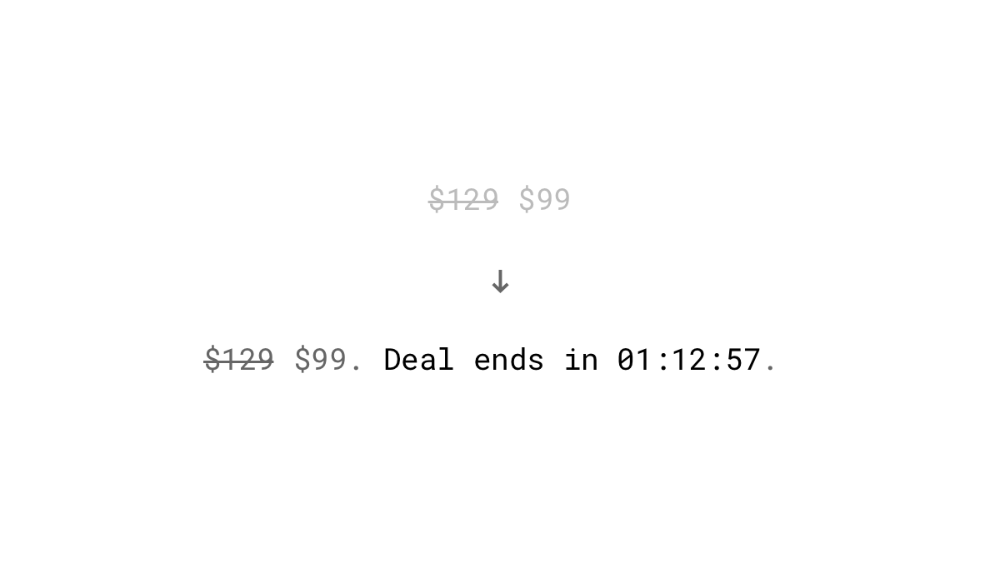
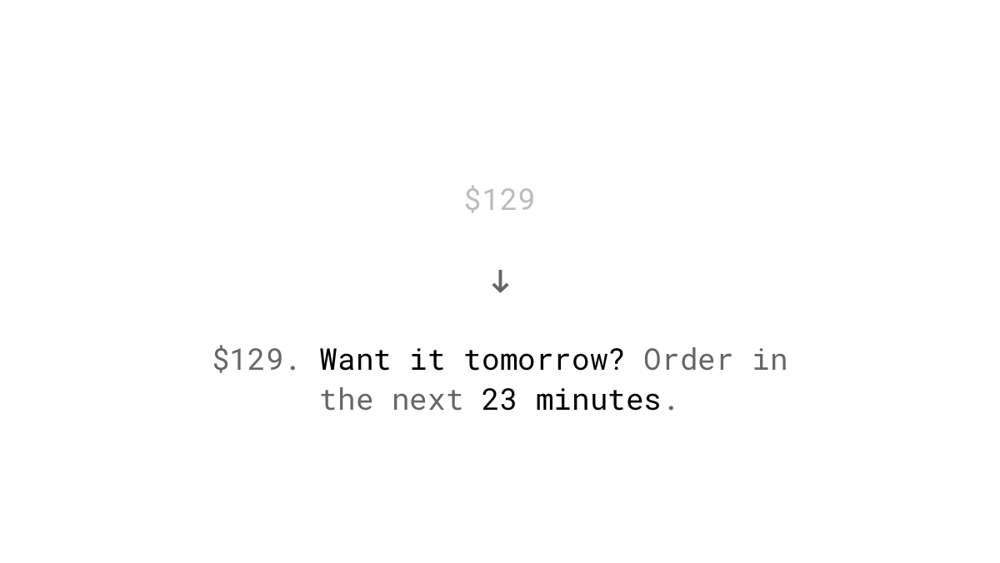
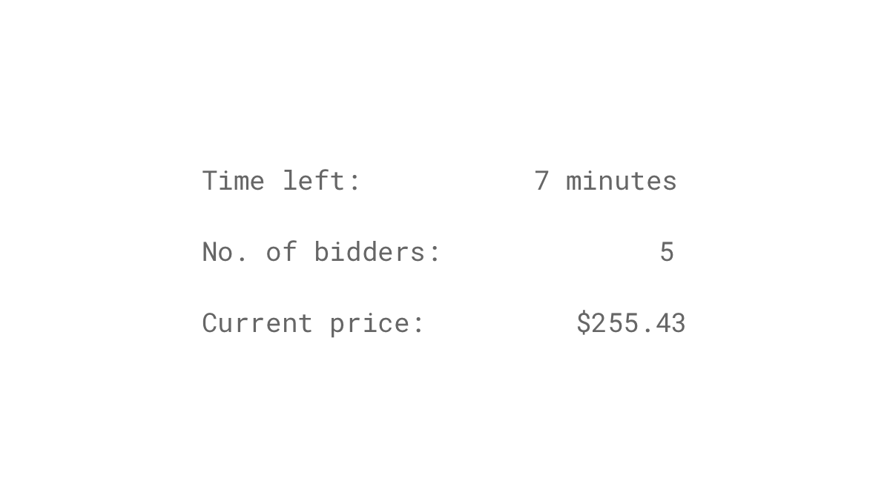

The harder it is to get something, the more we want it. People often link availability to quality. As seen in the concept of [loss aversion](/loss-aversion/), we're far more motivated by the fear of losing than by the desire of gaining.

## Studies

Women are more attracted to men who are in a relationship than to single guys ([Parker & Burkley, 2009](http://www.sciencedirect.com/science/article/pii/S0022103109001048?via=ihub)). It seems when something is limited or unattainable, it becomes more attractive.

One study shows that people value cookies more highly if they're scarce. Some participants were given a glass jar with ten cookies, while others only received two. In another condition, where the number of cookies was reduced from ten to two, participants rated these cookies the highest. ([Worchel, Lee & Adewole, 1975](http://psycnet.apa.org/record/1976-03817-001))

Scarcity tactics tend to be more effective when targeted at customers who have greater than average need for uniqueness. ([Lynn, 1991](http://scholarship.sha.cornell.edu/cgi/viewcontent.cgi?article=1181&context=articles))

## Examples

### Limited stock
Almost every e-commerce website employs scarcity by showing how few items are available in stock. As shown in the cookie experiment above by Worchel et al., we value more those things that have recently become less available to us.

### Limited stock for a particular model or size
Go even further and show how many items are available for a specific type, color or size or a combination of them.

### Exposing people to other buyers
While you're looking around and considering whether or not to book this hotel room, you suddenly realize that another person is checking out the same property. The fear of loss kicks in. Indicating how many people are currently viewing the same item is a powerful tactic to play up the scarcity game.

### Deadlines
Give your prospects a reason to act now by exposing them to time limits. But be careful. Unfortunately, some businesses started using this technique in scammy ways which may lead people to consider your offer more carefully.

### Limited time offers with countdown timers
Use animated timers to even more draw on people’s fear of missing out. This tactic is often used with some perceived benefit for acting fast like a reduced price or some additional bonus items.

### Time constraints for next-day shipping
Amazon shows the exact remaining time within the purchase has to be completed to qualify for next-day shipping. Shoppers who need a product immediately will impulsively buy it to ensure they get it the next day.

### Reducing the free trial length
When Hiten Shah, the co-founder of KISSmetrics, decreased the length of the trial period from 30 to 14 days, he saw a [102% increase in the usage](https://www.quicksprout.com/2013/01/14/11-obvious-ab-tests-you-should-try/) of the product. The reduction made the people feel that they had to use the service as soon as possible.

### Online auctions
A single-unit auction combines several scarcity elements at the same time: it's limited by quantity and time. Multiple people bid on one item in a limited timeframe, and there can be only one winner – a mix which led eBay to become such a huge company.

### Limiting feature or content availability
In today's online world, everything seems to be permanently available in abundance. Snapchat has reintroduced scarcity into the entertainment section. If you miss a story on Snapchat, which is only 24 hours available, you will never see it again. This feature is definitely one part of the app which makes it so sticky and persuades users to come back. Is there something in your product which can be artificially made scarce?

