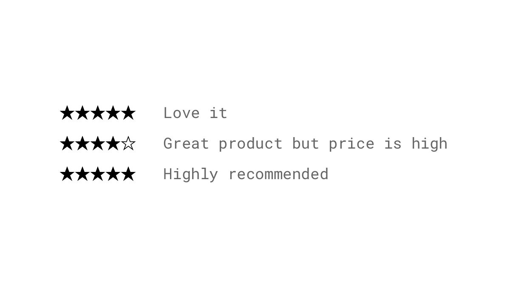
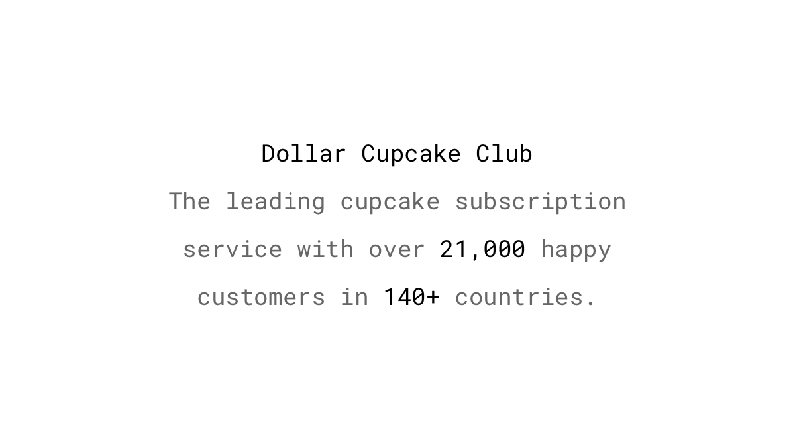
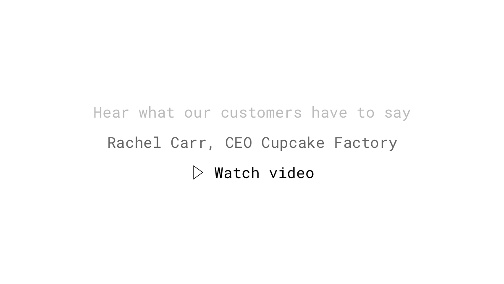
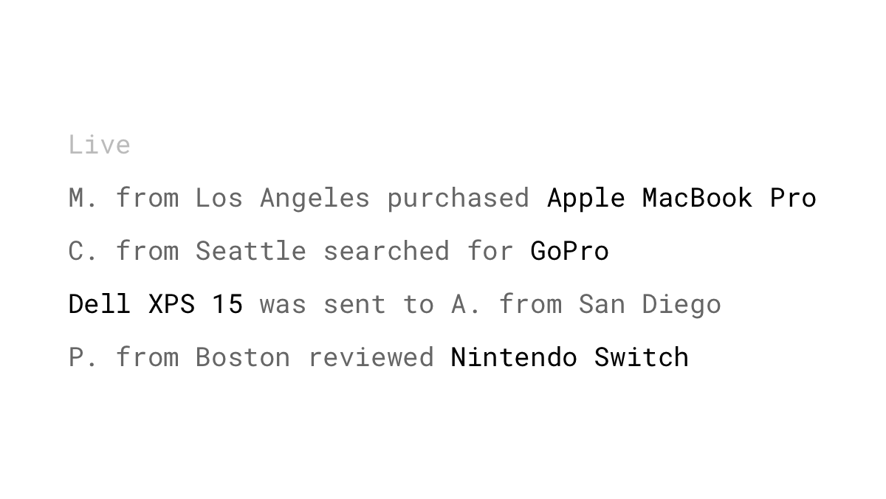

*"When you say it, it's marketing. When your customer says it, it's social proof."* Andy Crestodina

People are pack animals. We are more likely to do something when presented with evidence that others have done it, more than we are willing to admit. This behavior applies in particular when we are unsure of what to do.

## Studies

Participants in a study by [Baron, Vandello and Brunsman (1996)](http://psycnet.apa.org/doiLanding?doi=10.1037%2F0022-3514.71.5.915) were asked to identify a criminal suspect from a line-up. They saw the pictures very quickly, so it was difficult to be confident about their judgments. The task was performed in a group that consisted of one actual subject and two confederates of the experimenter. These two each chose the wrong person from the line-up. The subjects knowingly gave an incorrect answer so as not to disagree with the others when they were told the results were of little importance for pilot data, but were less likely to conform when they were told that the police and court would use their response.

A study found that a one-star increase in Yelp ratings led to a 5-9% growth in sales ([Luca, 2011](https://www.scribd.com/fullscreen/67460062)).

92% of people trust recommendations from their peers, and 70% of the consumers trust a recommendation from someone they don’t even know ([Nielsen, 2012](http://www.nielsen.com/us/en/insights/news/2012/trust-in-advertising--paid-owned-and-earned.html)).

## Examples

### Testimonials
Displaying quotes from happy customers is one of the most used and most persuasive forms of social proof online. Be sure to add a high-quality photo to boost the perceived credibility ([Newman, Garry, Bernstein, Kantner & Lindsay, 2012](https://www.ncbi.nlm.nih.gov/pubmed/22869334)).

### Social share count
Showing the raw number of social shares is a simple form of implementing social proof. People are more likely to read an article that has been shared by thousands. It gives more credibility and encourages even more shares. But, be careful. A low share count can create a negative social proof and is worse than no share count at all. People might think that the content you're providing isn’t good enough. [In an experiment by VWO](https://vwo.com/blog/removing-social-sharing-buttons-from-ecommerce-product-page-increase-conversions/), the removal of social sharing buttons led to an 11.9% conversion increase.

### Accumulated share count
Instead of displaying every counter separately, you can show the total number of shares across the different social networks to expose the user to an even higher number.

### Subscriber count
Show the people how many fans, subscribers, or followers you have. You can use the official [Twitter follow button](https://publish.twitter.com/#), the [Facebook page plugin](https://developers.facebook.com/docs/plugins/page-plugin), or the provided plugin of the community of your choice. Most larger platforms also provide a public API for developers, from which, alternatively, the subscriber count can be fetched.

### Reviews
According to the [Pew Research Center](http://www.pewinternet.org/2016/12/19/online-reviews/), 82% of Americans read reviews before making a buying decision. Furthermore, we are paying more attention to highly negative reviews than to the extremely positive ones. Therefore, check review sites like Yelp regularly to know what's being said about your brand and products. If you own an e-commerce store, displaying customer reviews can increase the conversion rate by [207%](https://www.yotpo.com/blog/ecommerce-conversion-rate/). A healthy mix of positive and negative customer reviews is more trustworthy and [can even improve conversions](https://www.crazyegg.com/blog/negative-reviews/).

### Influencer endorsements
Give your product away for free to people with a high social media influence in a niche area and ask them for feedback. Another way is to sponsor these (micro) influencers to post your product on their channels, or even hire them for long-term relationships as brand ambassadors. Since they have a positive reputation, people tend to associate this positivity with anything else they are involved with. This cognitive bias is called the *halo effect*.

### Quoting celebrities
Instead of having someone talk about your product, find a quote from a celebrity or an influencer that supports a bigger picture of your industry. Even if they are not directly associated with your product, showing a quote with a picture of them can add social proof through the halo effect.

### Customer case studies
Tell an in-depth story of how some of your customers use your product. This technique provides not only social proof, but also gives other potential clients ideas on how to use your product or service.

### Media mentions
Did a recognized media outlet give you a positive endorsement? Let others know by featuring their logo in a classical “as seen in” showcase, or by quoting positive things they say. Consumers often trust big publishers, so showing that they have mentioned you improves your brand’s legitimacy and trustworthiness.

### Integration with other platforms
Similar to the media mentions, displaying logos from big brands your service integrates with can also induce the halo effect, which can positively influence your brand’s credibility.

### Raw numbers
Expose your visitors to huge numbers on anything from your mailing list, customer base, and number of downloads to any relevant statistics that remind potential customers that a large crowd is using your service – so it must be good enough for them. Wordpress, for example, uses this powerful tactic in the headline of their landing page: “WordPress powers 28% of the internet.” Use exact numbers instead of rounded ones to be perceived as even more believable ([Mason, Lee, Wiley & Ames, 2013](https://www8.gsb.columbia.edu/researcharchive/articles/5957)).

### Mentioning numbers off-site
Go further and bring up these numbers, not only on your website, but also in the bio of your social media accounts or your ad copy.

### Video testimonials
It’s one thing to read about somebody’s experience with your service or product. It’s another to see and hear someone tell others how much they enjoy it. Allowing your prospects to immerse directly into the world of another customer will go much further in building trust.

### Real-time statistics
Present real-time data to your visitors, such as “89 people are shopping right now,” or “The last purchase of this course was 7 minutes ago” to build trust and create a sense of urgency.

### Live feed of user activity
Show your visitors that others are purchasing products, publishing posts, or doing something else that’s relevant to your service right now. It’s not only adding social proof, but also enhancing the discovery of items on your website.

### Sold out
Have you ever wondered why some online stores leave items that have sold out on their website? It's the combination of social proof and [loss aversion](/loss-aversion/): What others buy, it's safe for me to purchase, too, coupled with the fear of missing out again.

### Referrals
Attract new customers using social proof by offering a referral bonus for sending friends and family to the site. Recommendations from people we know personally continue to be the most trusted source for referrals ([Nielsen, 2012](http://www.nielsen.com/us/en/insights/news/2012/trust-in-advertising--paid-owned-and-earned.html)).

### Formal standard certifications
If your company operates in regulated industries, add credibility to your website by demonstrating that your business meets requirements of national or international standards organizations, such as ANSI or ISO.

### Verified social media accounts
Request a verification of your profile on Twitter, Instagram, Facebook, or another platform where you’re active, and you will usually receive a blue checkmark next to your name. This badge indicates that the social media platform deemed that your account is of public interest, authentic, and influential.

### Trust seals and badges
If a stranger asked you for your credit card details, how would you feel? Hesitant? Uncomfortable? Doubtful? Such feelings are similar to those that your customers may experience. Establish more credibility and legitimacy by displaying trust seals, security certificates, or association memberships.

### Backing it up with studies
Expose your visitors to hard facts and numbers backed by research to leverage the *expert social proof*. Present studies to your potential customers that exhibit the same benefits that your product provides.

### Thank publicly for received awards
If you've won an award or been publicly honored by the media, show appreciation for such mentions on your social media channels.

### Sharing milestones
Celebrate growth and the accomplishment of milestones with your audience, and thank them for helping you achieving them. This can be reaching a certain number of users, followers, downloads, or an anniversary.

### Engaging brand advocates
A brand advocate is a person who enjoys your product or service so much that they say amazing things about it. It’s not just someone who leaves a good review or agrees to be quoted for testimonials. They are passionate enough to share their positive experience with your brand repeatedly. An advocate says things with more credibility because money does not drive them. Keep them engaged, and you’ll likely catch more advocates along the way. Here are some ideas: Provide them a branded hashtag that they can put in posts or their bio, give discounts, or just send a handwritten note to let them know how much you appreciate their support.

