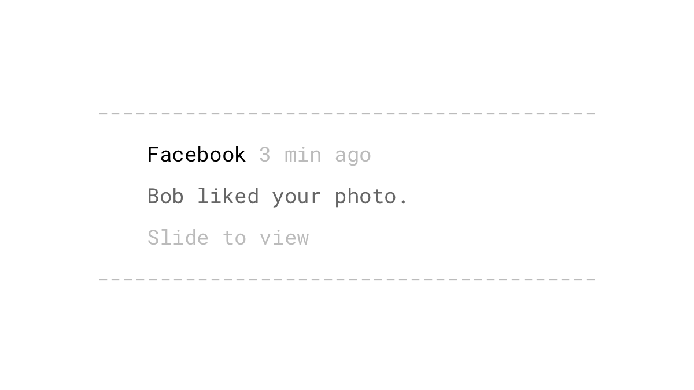
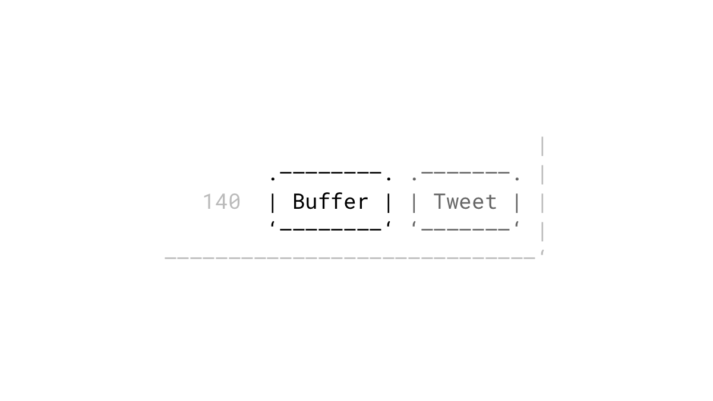
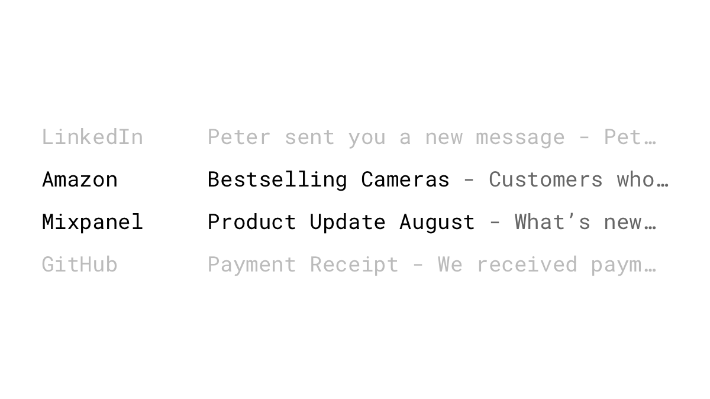
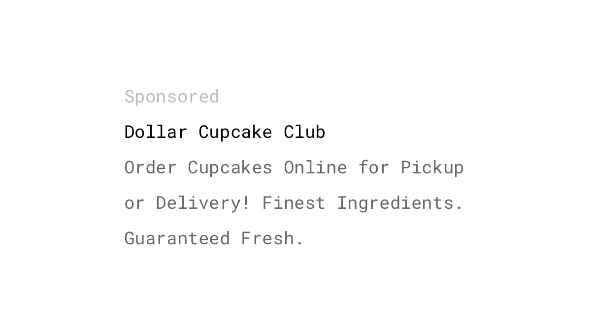
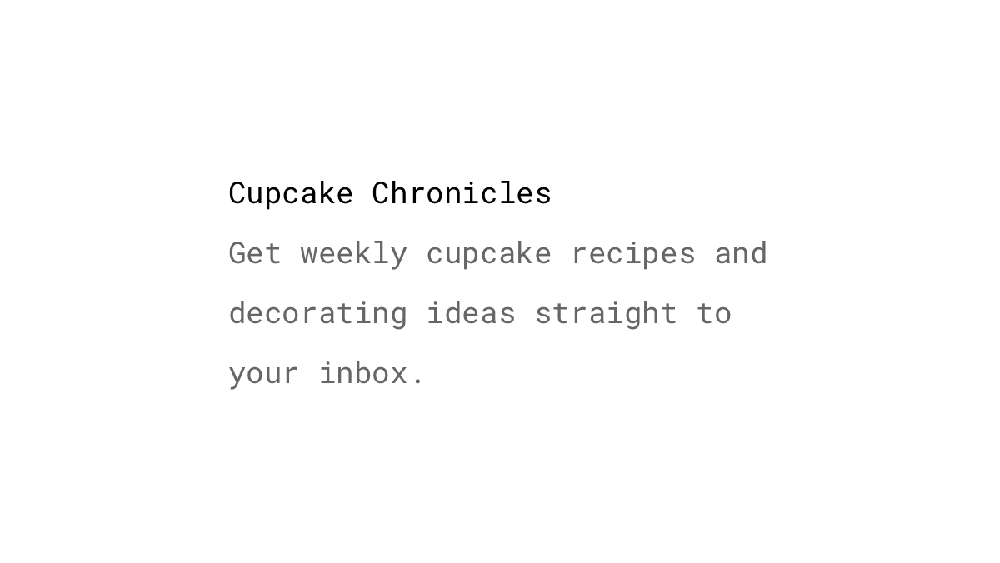

Triggers are anything that sparks us to complete a particular action. They tell us what to do next, and come in the form of internal and external triggers.

External triggers are all around us. They target our senses and remind us to take a particular action. It can be something obvious like a “Click here” button, but also something like the delicious smell of fresh coffee and cake while you’re walking down the street.

Internal triggers, on the other hand, are impulses that come from within us. Memories, emotions, or situations provide information for what to do next. For example, the fear of losing out on a moment triggers some people to take a photo and post it on Instagram. Internal triggers are a major factor for building habit-forming products, and are the drivers for the growth of billion dollar companies.

## Studies

Ivan Pavlov demonstrated that dogs could be conditioned to salivate at the sound of a bell ([Pavlov, 1927](http://psychclassics.yorku.ca/Pavlov/)). He trained the dogs to respond in that way by ringing a bell before feeding them. This learning procedure came to be known as *classical conditioning*.

According to BJ Fogg's behavior model, three elements must be present for the desired behavior to occur: motivation, ability, and trigger. In other words, it has to bring value, be simple to complete and should draw attention. If one or more is missing, the desired action will not happen ([Fogg, 2009](http://dl.acm.org/citation.cfm?doid=1541948.1541999)).

## Examples

### Calls to action
Every CTA, like a button or some other form of graphic or text, which guides your users and tells them what to do next, is an external trigger. Even the smallest tweaks in copy, color, position, or size can lead to huge lifts in conversion rate: Black and Decker, for example, saw a [17% increase in click-through rate](https://blog.optimizely.com/2014/07/03/black-decker-discovers-big-win-in-buy-now-vs-shop-now-test/) by using "Buy now" instead of "Shop now." Even two words on a button can have a huge impact on essential metrics.

### App icon on home screen
We [touch our phone 2,617 times a day and unlock it 76 times](https://blog.dscout.com/mobile-touches). Whenever we see the grid of apps, we're confronted with potential triggers. Red badges, which signal what we've missed, increase the sense of urgency even more. Remind your mobile visitors with an [install banner](https://developers.google.com/web/fundamentals/engage-and-retain/app-install-banners/) that they can add your website to their home screen and launch it in the full-screen mode, like a real native app.

### Push notifications
According to Localytics, [52%](http://info.localytics.com/blog/52-percent-of-users-enable-push-messaging) of all mobile users enable push notifications on their phone. If done right, they can have open-rates of up to [80%](http://blog.thanx.com/push-notification-open-rate-statistics-50-80) and are, therefore, effective external triggers to persuade people to complete certain tasks. Good push notifications are well-timed, explicit, and spark curiosity.

### Software updates
Have you ever been reminded through app updates that you have an app installed that you’ve forgotten is even on your phone? Releasing updates strategically can be a part of your marketing to retain existing users. Mobile systems like iOS and Android have update notifications built in. In addition to that, or for other platforms like web and desktop, you can send product update emails to inform your users about new features.

### Browser extension icons
Look at the menu bar in your browser. How many third party add-ons do you see there? Each time you open your browser, you notice these shiny icons, either consciously or unconsciously. For many companies, like Pinterest, Buffer, or Pocket, browser extensions are an essential part of a seamless workflow.

### Injecting content into other websites
Browser add-ons can modify the current page you’re on. Buffer, for example, adds a “Buffer” button in various places when you’re on Twitter. Refind, a social bookmarking service, injects and highlights links that you saved when you search on Google, so that you can read them when you need them. The Pinterest browser plugin adds a “Save” and “Discover similar” button to every image you hover your mouse over.

### Unread count badge
There are two types of users: those with hundreds of unread notifications, and those who can't relax until everything is cleared out. Notification badges are an easy way to indicate if there have been new activities or actions requiring our interest. These counters are often seen above mobile app icons, in the menu bar of web applications, or in browser tabs set via the HTML document title. It's also possible to show a [counter in your favicon](http://lab.ejci.net/favico.js/).

### Transactional emails
You sign up for a web app, and get welcomed with a lovely message in your inbox – that's a transactional email. A user's interaction or a time-based condition triggers these types of notifications. According to an email marketing study conducted by IBM, transactional emails have a [higher open-rate, by 116%](https://www-01.ibm.com/marketing/iwm/dre/signup?source=urx-13772&S_PKG=ov56286), than marketing emails because they're personalized, and we typically expect them. Common use cases include welcome emails, password resets, purchase confirmations, or notifications of important activities going on in your application.

### Marketing emails
There are many names, but all describe the same thing: Bulk, promotional, commercial, broadcast, or just marketing emails. Unlike transactional emails, this type is sent to more than one person, but contains the same content. Just a customized salutation does not make it different. Some examples are messages about product updates, website launches, event invitations, exclusive offers, and giveaways. It’s a thin line between retaining existing customers and being marked as spam. Only email people who have given you permission, don’t overdo it, but also don’t wait too long before contacting your subscribers. Stale email lists can lead to high bounce-rates and unsubscribes.

### Bookmarked sites
We, as humans, have a [fear of losing things that we already own](/loss-aversion/). So, we bookmark websites that seem interesting – some of us hoard them, literally. Once in a while, when we dare to go through the folder of bookmarks, we're faced with a huge list of potential triggers.

### Wish lists and favorites
Similar to the concept of bookmarks, we often see a “favorites” feature in many applications. Amazon and Airbnb call them wish lists. Twitter stores your favorite tweets under *Likes*, and on your phone, you can add contacts to *Favorites*. Giving a bookmarking mechanism to your users can increase the overall engagement on your platform. With every added favorite, the [user commits](/commitment-consistency/) more to the usage of the product.

### Search suggestions
The autocomplete design pattern has become somewhat of a convention for search functionalities. Search suggestions can help to create better queries by guiding users to the results they want. It can also encourage an exploratory search when the suggestions provided are relevant.

### Paid media
Everything from web banners to paid search marketing is used to acquire new customers, and falls within the category of paid triggers. It’s an effective way to expose your product’s name to a broad audience within a short time. Paid channels will continue to evolve with more features aimed at providing better audience targeting and, thus, better experiences for visitors. According to the research from [Ascend2](http://research.ascend2.com/2017-content-marketing-distribution-survey-summary-report/), 67% of the marketers interviewed said that search engine marketing is the most effective paid channel to distribute content, followed by social media ads with 50%.

### Owned media
A high-quality, digital presence is critical to success. Owned media refers to the content you create and publish on channels that you own. That includes your main website, blogs, and newsletters, but also any social media presence, which all act as an extension of your brand. The more owned media you have, the more potential external triggers you have to provide to acquire new visitors. Owned media leads to earned media.

### Earned media
In contrast to paid media, which gets in front of people by payment, earned media refers to exposure you’ve gained through word-of-mouth. Earned media is the tweet that praises your service. It’s the blog post that mentions your product and got shared by thousands. Establish yourself and your business as the leader in your niche, which will give you a ton of [social proof](/social-proof/) and credibility. Not everybody will like your brand. By publicly acknowledging hate against your business, you will increase the positive word-of-mouth created by your brand lovers ([Monahan, Espinosa & Ortinau, 2017](https://www.researchgate.net/publication/314266211_Hate_Does_Not_Have_to_Hurt_The_Influence_of_Hate-Acknowledging_Advertising_on_Positive_Word_of_Mouth_An_Extended_Abstract)).

### Internal triggers
They happen all the time. Unlike the external triggers from the previous examples, you can’t see or hear an internal trigger. Internal triggers automatically manifest in your mind through the emotions, situations, places, and people around you. Negative emotions, especially, are powerful triggers. Just a spark of loneliness, boredom, or fear of missing out will make us check Facebook, Instagram, or Snapchat. Researchers find that people with depressive symptoms tend to [check their inboxes more often](http://www.nytimes.com/2012/06/17/opinion/sunday/how-depressed-people-use-the-internet.html?mcubz=3), which relates to high levels of anxiety. The Holy Grail is to convert external triggers to internal ones, bringing a user back again and again by attaching your product to their daily routines and emotions. Ask yourself in which situations might your users find themselves in when the desired habit could be built, and see if an external trigger can be fired closely to that moment.

